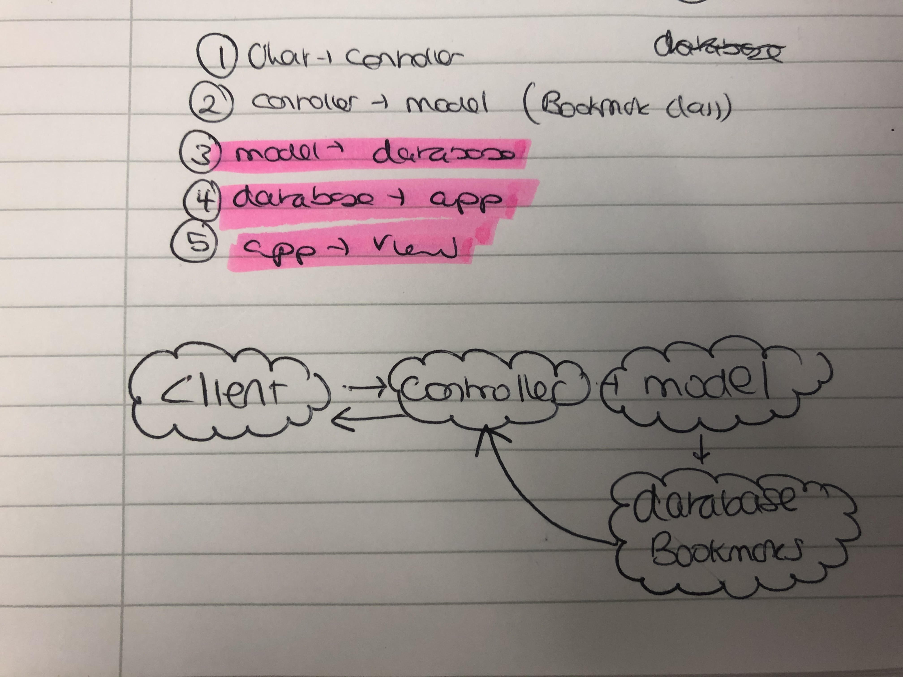

# Bookmark Manager
## User Story 1:

As a user,
So I can keep track of useful webpages,
I would like to be able to list of bookmarks (useful webpages) -->

## Setting up database from scratch:

1. Connect to psql
2. Create the database using the psql command CREATE DATABASE bookmark_manager;
2. Connect to the database using the pqsl command \c bookmark_manager;
3. Run the query we have saved in the file 01_create_bookmarks_table.sql
